### Escuela Colombiana de Ingeniería
### Arquitecturas de Software - ARSW

## Escalamiento en Azure con Maquinas Virtuales, Sacale Sets y Service Plans

### Dependencias
* Cree una cuenta gratuita dentro de Azure. Para hacerlo puede guiarse de esta [documentación](https://azure.microsoft.com/en-us/free/search/?&ef_id=Cj0KCQiA2ITuBRDkARIsAMK9Q7MuvuTqIfK15LWfaM7bLL_QsBbC5XhJJezUbcfx-qAnfPjH568chTMaAkAsEALw_wcB:G:s&OCID=AID2000068_SEM_alOkB9ZE&MarinID=alOkB9ZE_368060503322_%2Bazure_b_c__79187603991_kwd-23159435208&lnkd=Google_Azure_Brand&dclid=CjgKEAiA2ITuBRDchty8lqPlzS4SJAC3x4k1mAxU7XNhWdOSESfffUnMNjLWcAIuikQnj3C4U8xRG_D_BwE). Al hacerlo usted contará con $200 USD para gastar durante 1 mes.

### Parte 0 - Entendiendo el escenario de calidad

Adjunto a este laboratorio usted podrá encontrar una aplicación totalmente desarrollada que tiene como objetivo calcular el enésimo valor de la secuencia de Fibonnaci.

**Escalabilidad**
Cuando un conjunto de usuarios consulta un enésimo número (superior a 1000000) de la secuencia de Fibonacci de forma concurrente y el sistema se encuentra bajo condiciones normales de operación, todas las peticiones deben ser respondidas y el consumo de CPU del sistema no puede superar el 70%.

### Escalabilidad Serverless (Functions)

1. Cree una Function App tal cual como se muestra en las  imagenes.

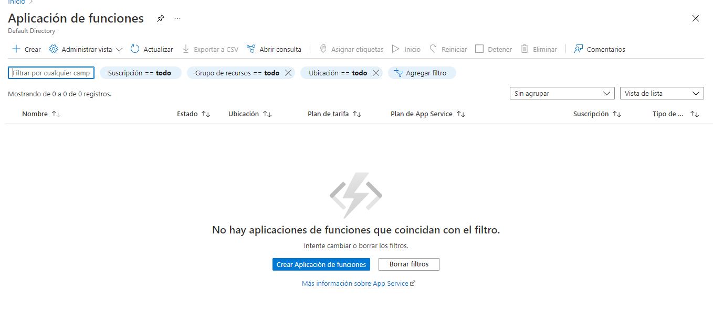

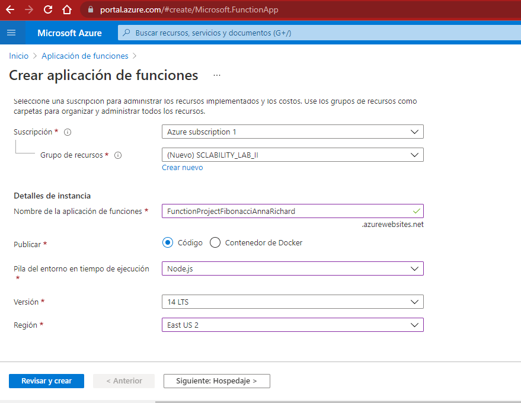

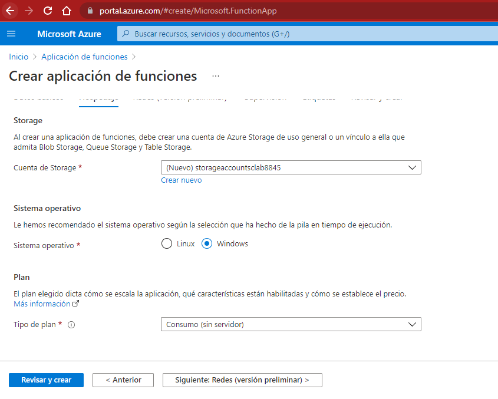

2. Instale la extensión de **Azure Functions** para Visual Studio Code.

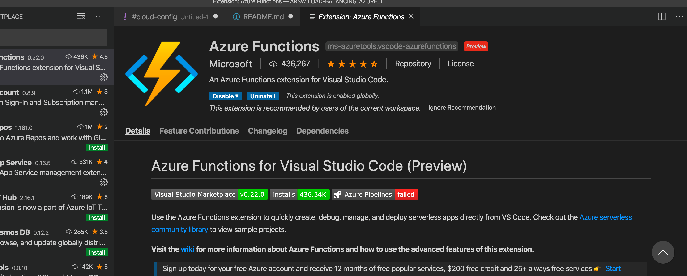

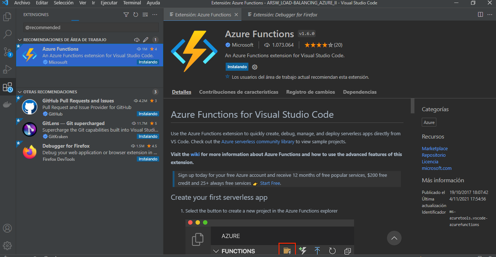

3. Despliegue la Function de Fibonacci a Azure usando Visual Studio Code. La primera vez que lo haga se le va a pedir autenticarse, siga las instrucciones.

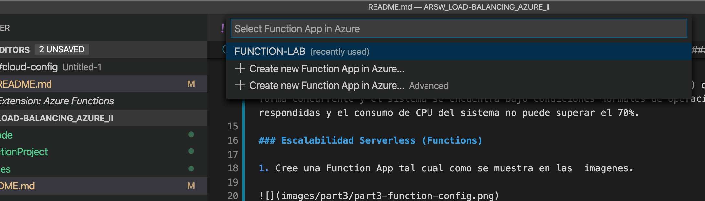

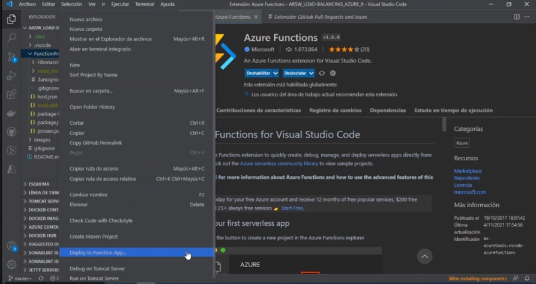

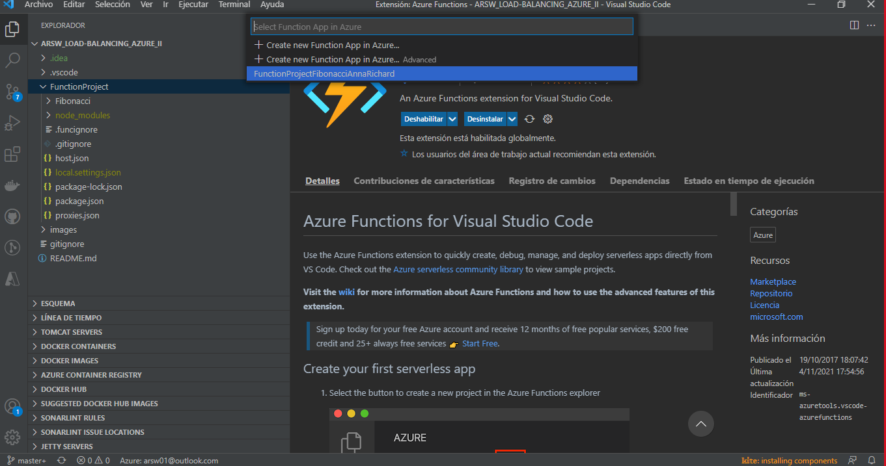

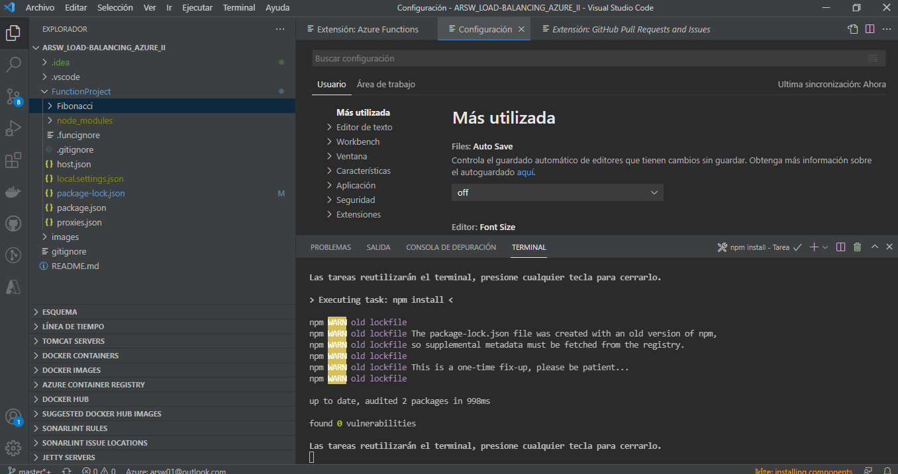

4. Dirijase al portal de Azure y pruebe la function.

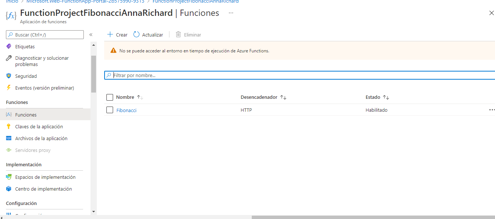

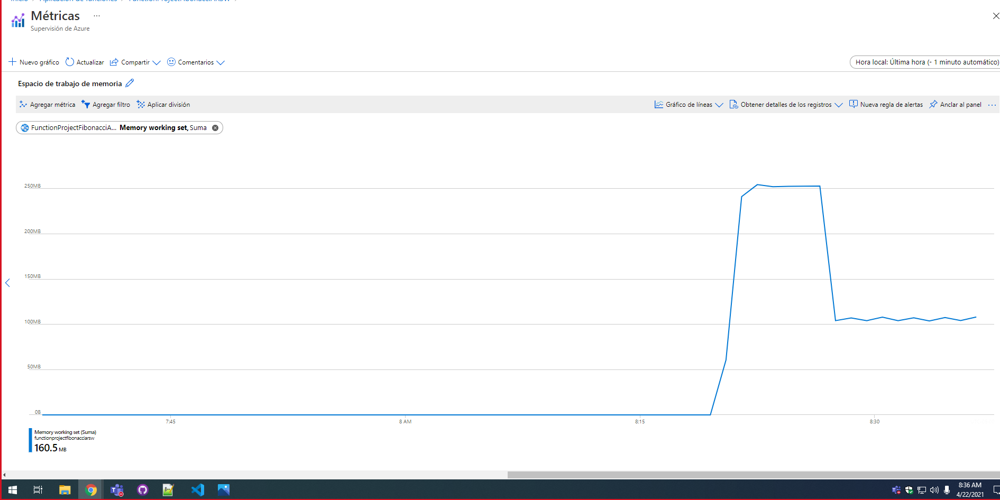

5. Modifique la coleción de POSTMAN con NEWMAN de tal forma que pueda enviar 10 peticiones concurrentes. Verifique los resultados y presente un informe.

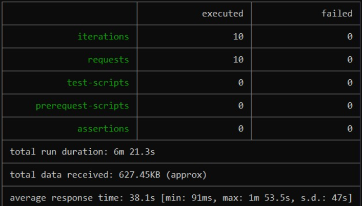

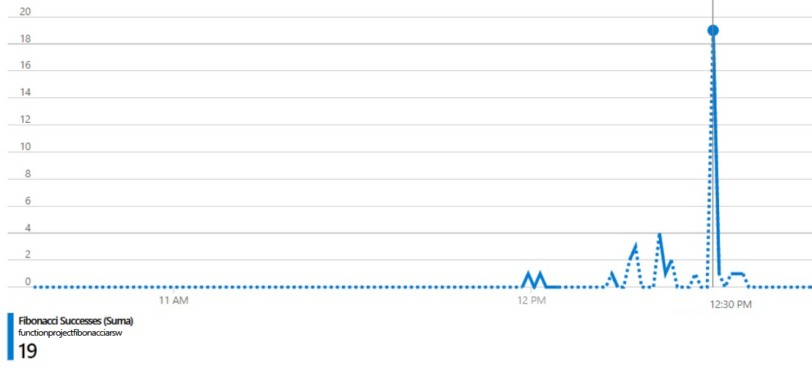

6. Cree una nueva Function que resuleva el problema de Fibonacci pero esta vez utilice un enfoque recursivo con memoization. Pruebe la función varias veces, después no haga nada por al menos 5 minutos. Pruebe la función de nuevo con los valores anteriores. ¿Cuál es el comportamiento?.

Primero, se realizaron dos pruebas, en la primera se calculó el 1000 n-ésimo número y en la segunda el 10000 n-ésimo número.

Prueba 1

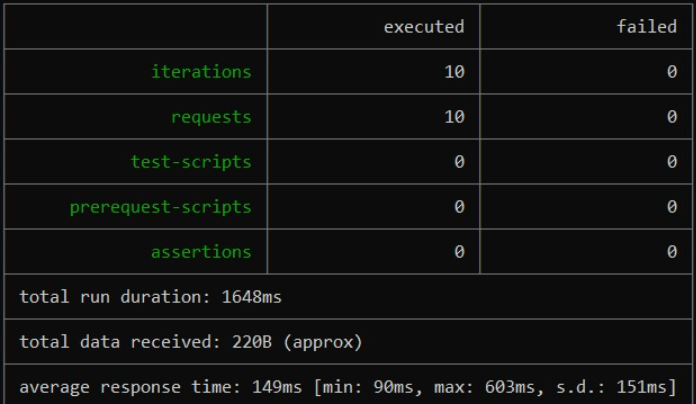

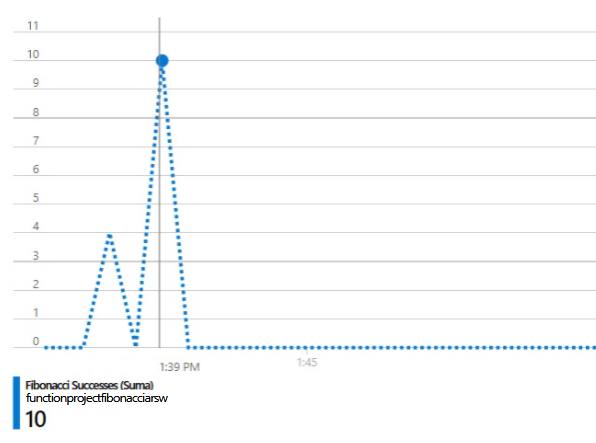

Prueba 2

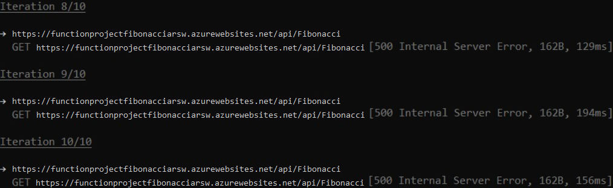

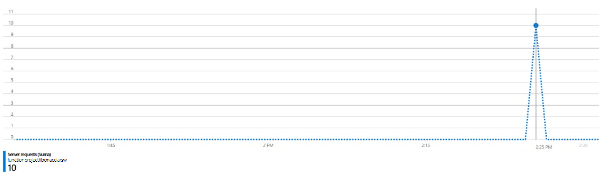

Conclusion

Como se puede observar en la primera prueba, todas las peticiones fueron exitosas, mientras que en la segunda prueba todas las peticiones fallaron debido a los límites de la recursión. Además, con este nuevo enfoque los tiempos de respuesta se redujeron bastante.

**Preguntas**

* ¿Qué es un Azure Function?

> Azure Functions es un servicio en la nube disponible bajo demanda que proporciona toda la infraestructura y los recursos continuamente actualizados necesarios para ejecutar sus aplicaciones. Usted se concentra en los fragmentos de código que más le importan y Functions se encarga del resto. Functions proporciona procesamiento sin servidor para Azure. Puede usar Funciones para crear API web, responder a cambios en la base de datos, procesar transmisiones de IoT, administrar colas de mensajes y más.[Azure functions](https://docs.microsoft.com/en-us/azure/azure-functions/)

* ¿Qué es serverless?

> Es un modelo de ejecución de computación en la nube en el que el proveedor de los servicios en la nube destina por demanda recursos de las máquinas virtuales, cuidando de los servidores por sus clientes [Serverless](https://es.wikipedia.org/wiki/Serverless_computing)

* ¿Qué es el runtime y que implica seleccionarlo al momento de crear el Function App?

> Un runtime carga todas las aplicaciones de un programa y las ejecuta en una plataforma. Esta plataforma pone a disposición todos los recursos necesarios para ejecutar el programa independientemente del sistema operativo.

* ¿Por qué es necesario crear un Storage Account de la mano de un Function App?

> Es necesario para las operaciones de almacenamiento y administracion que realizan las Function App.

* ¿Cuáles son los tipos de planes para un Function App?, ¿En qué se diferencias?, mencione ventajas y desventajas de cada uno de ellos.

**Plan de consumo** 
	Escale de forma automática y pague los recursos de proceso solo cuando se ejecuten las funciones.  
	En el plan de consumo, las instancias del host de Functions se agregan y quitan de forma dinámica según el número de eventos de entrada.  
	* Plan de hospedaje predeterminado.  
	* Pague solo cuando se ejecutan las funciones.  
	* Escala de forma automática, incluso durante períodos de carga elevada. 
	
**Plan Premium**   
	Escala automáticamente en función de la demanda mediante trabajos preparados previamente que ejecutan aplicaciones sin ningún retraso después de estar inactivas, ejecuta en instancias más eficaces y se conecta a redes virtuales.  
	Considere la posibilidad de elegir el plan Premium de Azure Functions en las siguientes situaciones:  
	* La aplicación de funciones se ejecuta de forma continua, o casi continua.  
	* Tiene un gran número de ejecuciones pequeñas y una factura de ejecución elevada, pero pocos GB por segundo en el plan de consumo.   
	* Necesita más opciones de CPU o memoria de las que proporciona el plan de consumo.  
	* Su código debe ejecutarse durante más tiempo del máximo permitido en el plan de consumo.  
	* Necesita características que no están disponibles en el plan de consumo, como la conectividad con red virtual.
	
**Plan dedicado**  
	Ejecute las funciones en un plan de App Service a los Precios de App Service normales.
	Mejor para escenarios de ejecución prolongada en los que no se puede usar Durable Functions. Considere el plan de App Service en las situaciones siguientes:  
    * Tiene máquinas virtuales infrautilizadas que ya ejecutan otras instancias de App Service.  
	* Quiere proporcionar una imagen personalizada en la que ejecutar sus funciones.  
	* Se requieren escalado y costos predictivos.  

* ¿Por qué la memoization falla o no funciona de forma correcta?

> No funciona de la manera correcta porque los numeros que se generan son muy grandes, esto hace que la memoria se consuma dado esto la memorizacion no funciona. 

* ¿Cómo funciona el sistema de facturación de las Function App?

> Functions se factura según el consumo de recursos observado, medido en gigabytes por segundos (GB-s). El consumo de recursos observado se calcula multiplicando el tamaño medio de memoria en GB por el tiempo en milisegundos que dura la ejecución de la función. La memoria que una función utiliza se mide redondeando al alza a los 128 MB más cercanos hasta un tamaño de memoria máximo de 1.536 MB, y el tiempo de ejecución se redondea al alza a los 1 ms más cercanos. Para la ejecución de una única función, el tiempo de ejecución mínimo es de 100 ms y la memoria mínima es de 128 MB, respectivamente. Los precios de Functions incluyen una concesión gratuita al mes de 400.000 GB-segundos.

### Autores

## juan camilo molina leon

